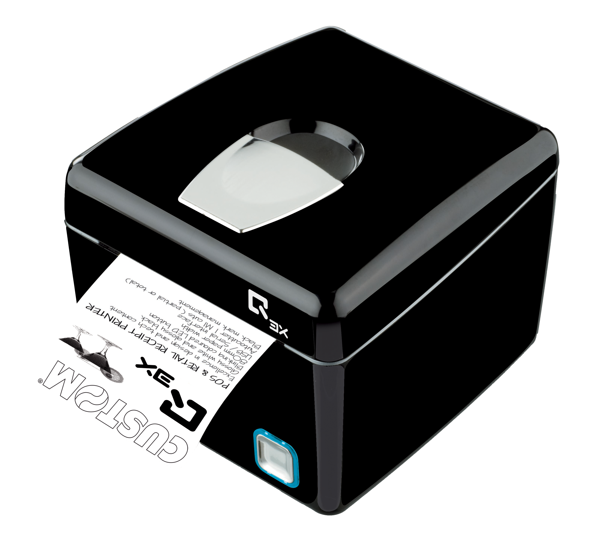

# Q3X

## STAMPANTE Q3X BTH IAP2 USB RS232

### Descrizione

Q3X è la risposta ideale per chi è alla ricerca di prestazioni all'avanguardia e design. La testina termica garantisce un'eccellente qualità di stampa anche in grafica e allo stesso tempo minori consumi. La taglierina è stata realizzata per ottimizzare le performance di questo prodotto sia in efficienza che in affidabilità e risponde anche alle più sofisticate esigenze operative. Il design elegante, studiato per integrarsi in ogni ambiente, si coniuga perfettamente all'elevato contenuto tecnologico. Stampa su carta termica di larghezza 80 mm, con uscita frontale dello scontrino.
Dotata di interfaccia seriale e USB.

### Highlights

- Stampante ricevute / fatture e comande
- Larghezza carta 80mm
- Dimensione rotolo carta: max Ø 80 mm
- Velocità di stampa: 140 mm/s
- Eccellenza nel design e nel contenuto tecnologico
- Risoluzione: 200 dpi
- Interfacce: RS232, USB, Bluetooth, cassetto
- Grammatura carta: da 55 a 60 g/m²
- Taglierina con taglio parziale
- Stampa barcode 1D e 2D (PDF417, QRCode)
- Gestione black mark per autoallineamento (ricevute/fatture)
- Pulsante con LED a colori lampeggiante
- Uscita ticket frontale
- Testina di stampa: 200 km
- Printer Set, tool per la configurazione della stampante da PC (Windows) o via mobile (Android™)
- Custom Power Tool, editor avanzato di biglietti

#### Modello

- 911FF010100K33 STAMPANTE Q3X BTH IAP2 USB RS232

#### Accessori

- 971GF010000700 CASSETTO IN METALLO GRANDE 24V
- 26500000000352 CAVO RS232 9M/9F 1.8M
- 26500000000356 CAVO USB A MASC B MASC 1.8MT

#### Consumabili

- 67300000000398 ROTOLO CARTA TERMICA 80X80 DI13

- [MANUALE UTENTE Q3X](assets/resources/manualeq3x.pdf)