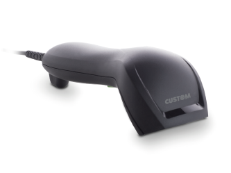
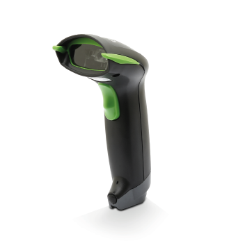
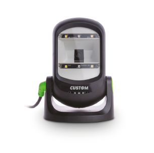

# SCANMATIC

## SCANMATIC BARCODE SCANNER SM100 1D USB

### Descrizione
Lo scanner di codici a barre SM100 garantisce ottime prestazioni nelle operazioni di cassa presso i punti vendita,
grazie alla tecnologia di ultima generazione integrata. È un lettore di codici a barre affidabile ed adatto a diversi ambienti
lavorativi. Le caratteristiche dell'SM100 e il suo eccezionale rapporto qualità-prezzo lo rendono la soluzione migliore per
applicazioni retail e gagazzino. L'SM100 è caratterizzato da una linea ergonomica ed è dotato di interfaccia USB. Il potente
scanner integrato legge tutti i principali codici a barre 1D e le simbologie GS1 DataBar™, compresi i codici danneggiati
o con difetti di stampa. Legge inoltre su display, riducendo i tempi di elaborazione, i costi di manodopera, aumentando
la precisione. Il Software di programmazione ScannerSet,fornisce ampie opzioni di configurazione. L'SM100 è una delle
soluzioni più convenienti sul mercato ed è la scelta migliore per qualsiasi ambiente di vendita al dettaglio.

#### Highlights

- La miglior soluzione per rapporto qualità-prezzo sul mercato, da utilizzare in applicazioni retail, POS e magazzino
- Profondità di lettura fino a 200 mm
- Supporta una risoluzione minima di 4 mil / 0,1 mm
- Legge la maggior parte delle simbologie di codici a barre 1D, inclusi i codici GS1 Databar™
- Interfacce: USB, USB HID, VCOM
- Resistente a scariche elettrostatiche da 16 kV sia a contatto che in aria
- Progettato per una protezione di tenuta IP41
- Collegabile a tablet o smartphone Android con cavo opzionale
- Software: Custom ScannerSet

### SCANMATIC BARCODE SCANNER SM200 2D USB

### Descrizione

Lo scanner di codici a barre SM200 garantisce ottime prestazioni nelle operazioni di cassa presso i punti vendita, grazie alla tecnologia di ultima generazione integrata. È un lettore di codici a barre affidabile adatto a diversi ambienti lavorativi. Le caratteristiche dell'SM200 e il suo eccezionale rapporto qualità-prezzo lo rendono la soluzione migliore per applicazioni retail e magazzino. L'SM200 è caratterizzato da una linea ergonomica ed è dotato di interfaccia USB. Il potente scanner integrato legge tutti i principali codici a barre 1D, 2D e le simbologie GS1 DataBar™, compresi i codici danneggiati o con difetti di stampa. Legge su display, riducendo i tempi di elaborazione, i costi di manodopera, aumentando la precisione. Il Software di programmazione ScannerSet, fornisce ampie opzioni di configurazione. L'SM200 è una delle soluzioni più convenienti sul mercato ed è la scelta migliore per qualsiasi ambiente di vendita al dettaglio.

#### Highlights

• Eccellenti prestazioni di lettura per i principali codici a barre 1D e 2D, ad es. di codici QR, anche con il 30% di danni o un pattern mancante
• La miglior soluzione per rapporto qualità-prezzo sul mercato, da utilizzare in applicazioni retail, POS e magazzino
• Interfacce: USB, USB HID, VCOM
• Resistente a scariche elettrostatiche da 16 kV sia a contatto che in aria
• Progettato per una protezione di tenuta IP41
• Collegabile a tablet Android o smatphone con cavo opzionale
• Software: Custom ScannerSet

## SCANMATIC BARCODE SCANNER SM410 1D + KIT

## Descrizione
SCANMATIC SM410 è lo scanner di codici a barre 1D professionale, progettato per offrire il meglio dell'esperienza
all'utilizzatore in termini di velocità, semplicità di utilizzo e assenza di errori. I lettori SCANMATIC hanno un design
moderno con case robusto, protezione IP42 e garantiscono prestazioni uniche. Grazie alla tecnologia CCD long range e
allo stand opzionale è possibile utilizzare il lettore a mani libere. Oltre a sostenere lo scanner, lo stand consente di
attivare la funzione "intelligent activation" grazie alla quale è possibile la scansione automatica dei codici a barre quando
presentati davanti al lettore. I lettori SCANMATIC sono collegabili direttamente ai registratori di cassa telematici
Custom e preconfigurati per garantire una installazione davvero semplice e veloce.

### Highlights

• Disponibili come kit scanner "Lotteria degli Scontrini"
• Semplicità di installazione grazie alla pre-configurazione
• Codici supportati: tutti gli UPC / EAN / JAN, Codice EAN128, Codice 39, Codice 39 Full ASCII, Codice 32 / Farmacie
Italiane, Codice 128, CODABAR / NW7, Interleave 25, Industrial 25, MSI / PLESSEY, Codice 93, GS1, Databar
Omnidirectional and Stacked, GS1 Databar Limited, GS1 Databar Expanded and Stacked
• Interfacce: USB, USB HID, VCOM, RS232
• Ottime prestazioni di lettura in ambienti con scarsa luce
e su supporto etichette
• Protezione IP42
• Stand opzionale per facilitare la lettura a mani libere
• Rilevamento automatico con "intelligent activation"
• Software:Custom ScannerSet
• Peso: 110 g

## SCANMATIC BARCODE SCANNER SM420 2D

## Descrizione

SCANMATIC SM420 è lo scanner di codici a barre 2D professionale, progettato per offrire il meglio dell'esperienza
all'utilizzatore in termini di velocità, semplicità di utilizzo e assenza di errori. I lettori SCANMATIC hanno un design
moderno con case robusto, protezione IP42 e garantiscono prestazioni uniche. Grazie alla tecnologia CCD long range e allo
stand opzionale è possibile utilizzare il lettore a mani libere.
Oltre a sostenere lo scanner, lo stand consente di attivare la funzione "intelligent activation" grazie alla quale è possibile
la scansione automatica dei codici a barre quando presentati davanti al lettore. SCANMATIC garantisce una velocità di
operazione eccezionale non dovendo orientare il codice per la lettura. I lettori SCANMATIC sono collegabili direttamente
ai registratori di cassa telematici Custom e preconfigurati per garantire una installazione davvero semplice e veloce.

### Highlights
• Disponibili come kit scanner "Lotteria degli Scontrini"
• Semplicità di installazione grazie alla pre-configurazione
• Codici supportati: 1D e 2D
• Codici opzionali: Aztec, Micro PDF 417, Micro QR Code, Han Xin Code, GM Code
• Interfacce: USB, USB HID, VCOM
• Ottime prestazioni di lettura in ambienti con scarsa luce e su supporto etichette
• Protezione IP42
• Stand opzionale per facilitare la lettura a mani libere
• Rilevamento automatico con "intelligent activation"
• Disponibile kit cavo seriale, per trasformare il lettore 2D
USB in un lettore 2D Seriale
• Software: Custom ScannerSet

## SCANMATIC BARCODE SCANNER SM425 2D WIRELESS

## Descrizione

Il nuovo lettore di codici a barre 1D-2D SM425, wireless e dotato di Bluetooth®, presenta un design moderno,
una struttura robusta e supporta la protezione IP42, particolarmente adatta per la vendita al dettaglio, la
logistica e il magazzino. SM425 è dotato di funzioni utili che semplificano le operazioni del cliente e consentono di
risparmiare spazio. Dotato di eccellenti prestazioni nella lettura della maggior parte dei codici a barre 1D e 2D, facilita
l'utilizzo dei dati e aumenta la produttività. Supporta la scansione di codici a barre con una profondità di lettura fino a
250 mm per la maggior parte dei codici a barre 1D e 2D e codici GS1 DataBar™. Lo scanner SM425 può essere utilizzato sia
in modalità manuale (pulsante), sia in modalità automatica, utilizzando il cradle in dotazione. Lettore barcode wireless
Bluetooth® con cradle di ricarica incluso.

### Highlights

• Eccellenti prestazioni di lettura per codici Databar 1D,2D e GS1
• Lettura sia sul display che su etichette stampate
• Supporta la lettura automatica
• Collegabile a tablet o smartphones Android™
• Sorgente luminosa: luce LED bianca
• Sensore (HxV): 1280 x 800 pixel
• Profondità di campo: orizzontale - 55°, verticale - 35°
• Velocità di scansione: 60 fps (a risoluzione massima)
• Distanza di lettura: 250 mm@20 mil / 0.5 mm, PCS90%
• Luce ambientale: 100000 Lux max.
• Interfacce: Bluetooth, USB, USB HID, VCOM
• Batteria scanner: Li-Ion 3.7 V / 2600 mA
• Tempo di ricarica scanner: circa 5 ore
• Durata batteria: 20000 letture a ciclo continuo
• Modulo Bluetooth®: Bluetooth® V2.1 EDR
• Ampiezza di collegamento: fino a 80 m (262.47 ft)
• Potenza di uscita RF: Class 1 (sotto 20dBm)
• Peso scanner: 160 g
• Peso cradle: 170 g

## SCANMATIC PRESENTATION BARCODE SCANNER SM600U 1D/2D

## Descrizione

SM600U è un Imaging Presentation Scanner, compatto e omnidirezionale. La sua rivoluzionaria tecnologia di imaging
è racchiusa in un design solido, ma elegante. Le dimensioni compatte e l’ingombro ridotto lo rendono la soluzione ideale
per l'utilizzo in piccoli spazi. Con SM600U avrete la possibilità di scansionare i codici a barre 1D o 2D, partendo dalle
etichette arrivando alla lettura su display di: coupon, gift card, carte fedeltà, carte d'imbarco e persino biglietti per il teatro o
il cinema. SM600U garantisce prestazioni di lettura intuitive e veloci grazie alla semplicità di scansione point-and-shoot che
permette di non allineare il codice a barre alla linea di lettura.

### Highlights

• Scansiona la maggior parte dei codici a barre 1D e 2D su carta, telefoni cellulari e display di computer
• Con le dimensioni compatte e il minimo ingombro può adattarsi in piccoli spazi
• Supporta la scansione automatica, a mani libere
• La modalità multi-code consente la scansione simultanea di più codici a barre
• La testa dello scanner può essere regolata avanti e indietro in un intervallo totale di 180° per adattarsi alla vostra
applicazione
• Strumento di configurazione disponibile e funzionalità di formattazione dei dati che eliminano la necessità di
modifiche al sistema host
• Resistenza a scariche elettrostatiche sia a contatto che in aria 20 kV
• Leggero ed ergonomico
• Interfacce: USB, USB HID, VCOM
• Tensione di alimentazione: