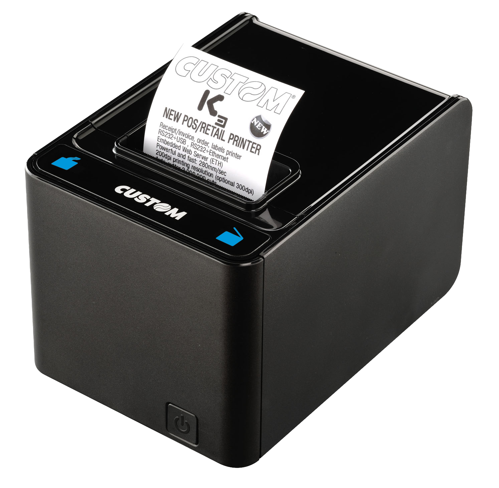
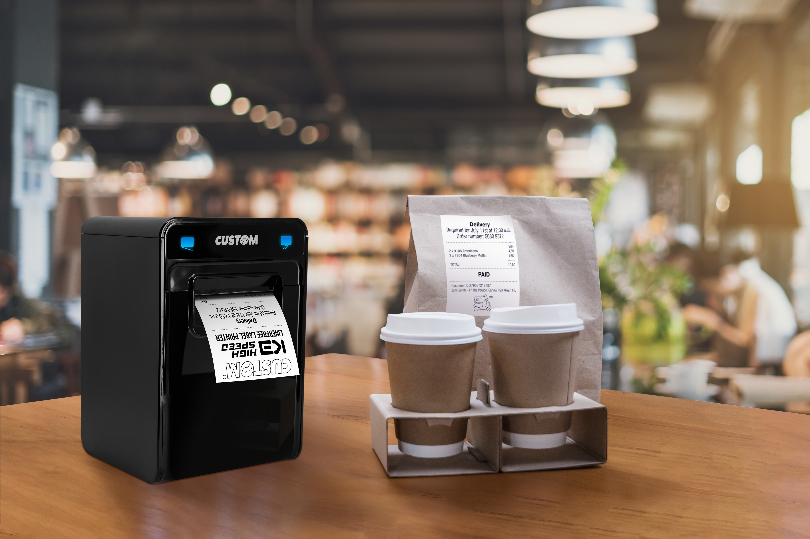

# K3 HS

## STAMPANTE K3 HIGH SPEED ETH USB RS232

### Descrizione

K3 HS è una stampante termica per ricevute ad alta prestazione, progettata per adattarsi a qualsiasi caso d'uso.
Con una velocità massima di 400 mm/s, è ideale per stampare ricevute, coupon, comande cucina, fatture e biglietti. K3 HS offre una connettività versatile anche wireless e supporta sistemi operativi Windows®, Linux, Android™ e iOS®.

### Highlights

- Risoluzione: 203 dpi (8 dots/mm)
- Velocità di stampa: max 400 mm/s
- Larghezza carta: 58 mm / 60 mm / 80 mm
- Grammatura carta: da 55 a 90 g/m²
- Dimensioni rotolo: max Ø 100 mm
- Memoria flash: Flash SPI 4 MB + 1 MB interna
- Memoria RAM: 64 MB
- Codici a barre supportati: UPCA, UPCE, EAN13, EAN8, CODE39, ITF, CODABAR, CODE93, CODE128, CODE32, QRCODE, DATAMATRIX, PDF417, AZTEC
- Vita testina: 100 km
- Taglierina: 1 milione di tagli, totale o parziale
- Interfacce: RS232, USB, Ethernet, porta cassetto
- Sensori: temperatura testina, presenza carta, rilevamento segno nero, copertura aperta, carta in esaurimento
- Driver: driver Linux CUPS (i386, amd64, armv7, armv8), driver COM virtuale (Windows® 32/64 bit, Linux SC), OPOS JavaPOS (Windows® 32/64 bit, Linux i386, amd64), Android™ (CustomAndroidPrintService su PlayStore)
- Tool software e SDK: PrinterSet, Android Printer Set, Custom Linux UPG (strumento di aggiornamento per Linux), Custom Power Tool, Vcom Service Custom Status
Monitor Service, Custom Windows API, Custom Android API, Custom iOS API
- Alimentazione: 24 Vdc
- Dimensioni (LxAxP): 206 x 140 x 148 mm
- Peso: 1,98 kg

#### Modello

- 911HM011200733 STAMPANTE K3 HIGH SPEED ETH USB RS232

#### Accessori

- 979HM020000004 KIT SCHEDA WIFI K3 HIGH SPEED
- 971GF010000700 CASSETTO IN METALLO GRANDE 24V
- 26500000000356 CAVO USB A MASC B MASC 1.8MT
- 26500000000352 CAVO RS232 9M/9F 1.8M
- 21400000000193 ADATTATORE CARTA DA 58/60MM PER K3
