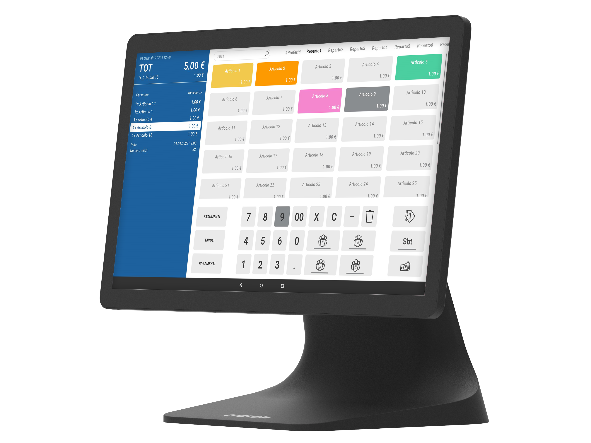

# SILK II

## PCPOS SILK II 15.6” ANDROID 11 4/64GB

### Descrizione

PCPOS con Android™ 11 standard e Google Play Store. Un set completo di interfacce USB consente di collegare tutti i suoi accessori. Sono integrati anche Bluetooth® e Wi-Fi®.

### Highlights

- Bluetooth® 5.0 integrato, Wi-Fi® 2,4 GHz
- Montaggio a parete o su chiosco (in posizione sia verticale che orizzontale)
- Processore: Rockchip RK3568 Quad Core 2.0 GHz
- Memoria: RAM 4 GB
- Storage: FLASH 64 GB
- Interfacce: 4 x USB 3.0, 2 x USB 2.0, 1 x RJ45 porta seriale (cassetto), 1 x HDMI uscita video, 1 x RJ12 cassetto, 1 x  scita audio
- LAN: 1 x RJ45 (10/100/1000 Gigabit)
- LCD: 15.6” FHD Wide
- Risoluzione: Full HD 1080p, 1920 x 1080
- Touch screen: PCAP
- Speaker: 1 x 3 W
- Wireless: Wi-Fi® 2.4 GHz, Bluetooth® 5.0
- Sistema operativo: Android™ 11 con Google Play Store
- Mercati: retail, hospitality, entertainment, gaming, lottery, betting
- Dimensioni (LxAxP): 220 x 308 x 205 mm; solo monitor su VESA (senza supporto)

#### Modello

- 935KY181000L33 PCPOS SILK II 15.6” ANDROID 11 4/64GB

#### Accessori

- 932KY470100M33 11.6” SECONDO DISPLAY LED
- 932KY470300M33 15.6” SECONDO DISPLAY LED
- 943KY470200233 MAG STRIPE + NFC + FINGERPRINT READER