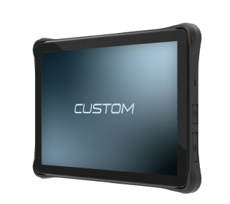

# T-RANGER

## RUGGED TABLET T-RANGER 10.1" ANDR 11 SCAN EU

### Descrizione

Molto robusto e alimentato da una batteria da 10000 mAh, T-Ranger è progettato per resistere ai rigori delle vostre operazioni tutto il giorno, tutti i giorni.
Interagite con i vostri clienti sul marciapiede, in corsia o alla cassa. Utilizzate il lettore NFC integrato o aggiungete una staffa opzionale per il pos di pagamento per facilitare le transazioni ovunque i vostri clienti vogliano fare acquisti. Scegliete il lettore di codici a barre 2D integrato opzionale e avrete a disposizione un potente strumento per gestire senza problemi l'inventario
in negozio e semplificare le operazioni di ricezione, prelievo e spedizione all'interno del magazzino. La protezione dello
schermo Gorilla Glass, la resistenza a cadute da 1.2 metri di altezza e la batteria sostituibile a caldo assicurano che il dispositivo sia protetto e sempre pronto all'uso.

### Highlights

- CPU: MTK 8788 8x Cortex, 4 Cortex A73 2 GHz/4 Cortex A53 2 GHz
- Memoria: 4 GB RAM / 64 GB ROM
- Sistema operativo: Android™ 11
- Display IPS da 10,1" 1920 x 1200 P FHD Multi-Touch con Gorilla Glass
- Luminosità: 400 cd/m²
- Scanner di codici a barre 1D/2D 4710 integrato
- Fotocamera: posteriore da 13 MP con flash LED, frontale da 8 MP
- Wireless: Wi-Fi 5, 2.4/5 GHz 802.11 a/b/g/n/ac, Bluetooth 4.2, 4G mobile WWAN (worldwide)
- Grado di protezione: IP65
- Connettività: Ethernet (solo con cradle) / POGO Pin per modulo esterno
- Interfacce: USB-C (ricarica e dati), USB-A OTG, Micro-HDMI (output), MicroSD Slot, 2 x nano SIM slots
- Batteria da 10000 mAh sostituibile
- Dimensioni (LxAxP): 246.1 x 14.9 x 164.2 mm
- Peso: 900 g (batteria inclusa)

#### Modello

- 93DHN015800L33 RUGGED TABLET T-RANGER 10.1" ANDR 11 SCAN EU

#### Accessori

- 970HN010000001 HAND STRAP T-RANGER
- 977HN010000016 DESKTOP CRADLE USB (A/B) LAN RS232 CHARGE PSU
- 977HN010000015 T-RANGER DOCKING USB-C CHARGE
- 48000000018800 BATTERIA DI RICAMBIO T-RANGER 10000 MAH